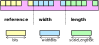
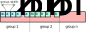

# Complex Packing and Spacial Differencing

This is the data format described in the section 5. Bytes 10 and after are
repectively the template number and the template. [template 5.2](https://www.nco.ncep.noaa.gov/pmb/docs/grib2/grib2_doc/grib2_temp5-2.shtml) is the Complex
Packing and template 5.3 is the Complex Packing and the Spacial Differencing.

## Complex Packing

The aim of the complex Packing is to reduce the size of the data. The method is
efficient when consecutive data are quite the same.

For instance data representing wind over the earth surface. Between 2
consecutive points, values do not fundamentally change a lot.

The principle of this method is to build group in which value variations are
small.


## Spacial Differencing

This methods relies on one or two reference values. The other data are just variations.

### First order

Given:

* a table of data `a[0]`, `a[1]`, `a[2]`, ... `a[n]`
* a first value `iVal1`
* a value `minSd`

The new values are:
* `x[0] = iVal1`
* `x[n] = a[n] + minSd + x[n-1]`

### Second Order

* a table of data `a[0]`, `a[1]`, `a[2]`, ... `a[n]`
* a two first values `iVal1` and `iVal2`
* a value `minSd`

The new values are:
* `x[0] = iVal1`
* `x[1] = iVal2`
* `x[n] = a[n] + minSd + 2.x[n-1] - x[n-2]`

## Scale

Scales are describes in [template 5.2](https://www.nco.ncep.noaa.gov/pmb/docs/grib2/grib2_doc/grib2_temp5-2.shtml):
* **binary scale factor:** bytes `16-17`
* **Decimal scale factor:** bytes `18-19`

And the **reference** is given at bytes `12-15` of the [template 5.2](https://www.nco.ncep.noaa.gov/pmb/docs/grib2/grib2_doc/grib2_temp5-2.shtml)


## Data organisation

In section 7, just after the length of the section (`1-3`) and the number of the
section (`5`), there is the data.

### Spacial Differencing parameters

First, there are the `iVal1`, optionally `iVal2` and then `minSd`. The number of
bits to encode these values is given in the [template 5.3](https://www.nco.ncep.noaa.gov/pmb/docs/grib2/grib2_doc/grib2_temp5-3.shtml),
byte `49` (Number of octets required in the data section to specify extra
descriptors needed for spatial differencing)


### Group descriptors

Then comes the group descriptors:

```golang
type bitGroupParameter struct {
	Reference uint64
	Width     uint64
	Length    uint64
}
```

the numbers of bits to encode data are:
- **reference**: byte `20` in [template 5.0](https://www.nco.ncep.noaa.gov/pmb/docs/grib2/grib2_doc/grib2_table5-0.shtml)
  (Number of bits used for each packed value for simple packing, or for each group
  reference value for complex packing or spatial differencing)
- **width**: byte `37` in [template 5.2](https://www.nco.ncep.noaa.gov/pmb/docs/grib2/grib2_doc/grib2_temp5-2.shtml) (Number of bits used for the group
  widths)
- **length**: byte `47` in [template 5.2](https://www.nco.ncep.noaa.gov/pmb/docs/grib2/grib2_doc/grib2_temp5-2.shtml) (Number of bits used for the scaled
  group lengths)

The number of groups is described on bytes `32-35` of [template 5.2](https://www.nco.ncep.noaa.gov/pmb/docs/grib2/grib2_doc/grib2_temp5-2.shtml)



### Grouped data

For each group, there is `length` elements encoded on `width` bits. The final
value is `val = reference + a[n]`.

